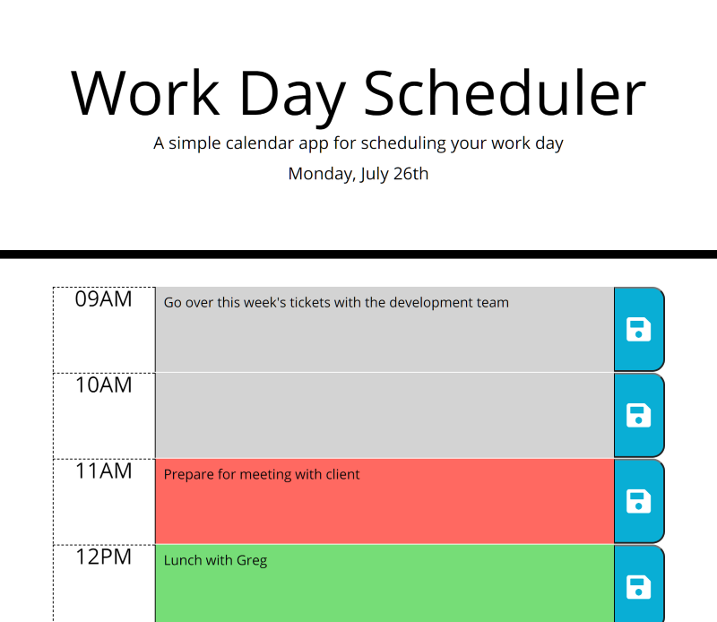

# Work-Day-Planner

## Introduction
This app is designed to be a way for busy people to plan out their day. It features the current date at the top of the page, and a timeblock for each hour of a normal business day. By clicking a timeblock, you can enter your event/task for that time of day. By clicking the save button next to the respective timeblock, you can save your entry to your local storage for later use. It will be available to you when you return to the page - even after navigating away from the application.

## Technologies
- HTML
- CSS
- Responsive Design
- Javascript
- JQuery
- Moment.js

## Screenshot

## Features
- Dynamically generated timeblock data
- Saving events to Local Storage for persistence
- Color coded timeblocks to let you know where you're at with your day
- The ability to visit the planner on any device and get an enjoyable experience

## Launch
Check out the daily planner in action: [Live Application Link](https://github.io/lukecp5/work-day-planner/)

### License
This application is licensed under the MIT License, you can find the full license information [here](https://github.com/lukecp5/work-day-planner/blob/main/LICENSE.txt)

